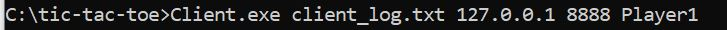

# **Tic-Tac-Toe**
## Intro
This is a C project I designed as part of an operating systems course.
The project is an online version of the beloved children's game, Tic-tac-toe. It is made up of 2 programs:
 1. Server program -- Runs the game, receives incoming messages from the client programs, computes the state of the game, and distributes messages to the client programs.
 2. Client program -- The game's UI. The program reads commands from the player and sends them to the server, receives game updates from the server and presents them to the player, it does not have the rules to the game or the state of the board.

This repo contains the code files of each of the programs and the compilied .exe files.

## Objectives
- Get a deeper understanding of threads in operating systems
- Work with multiple threads
- Use mutexes and semaphores to synchronize access to resources shared by multiple threads
- Get a deeper understanding of computer communications and sockets

### Requirements
This code was tested on Windows 10, 64 bit
### Running instructions
To run the game you must start the server program first, and only then start the client programs. Both programs should run from the command prompt.
Starting the server program should look something like this: ```Server.exe <logfile> <server port>```
* logfile -- Path to the output log file
* server port -- The server's port address

Example: 

Starting the client program should look like this: ```Client.exe <logfile> <server ip> <server port> <username>```
* logfile -- Path to the output log file
* server ip -- The server ip address
* server port -- The server's port address
* username -- The username

Example: 

**You may also run a server and client program (Or even server program and 2 client programs) on the same PC, by using the localhost address as the ip: ```127.0.0.1```**

### Server program instructions
Once the server program is running, there's no need to do anything. The program will listen in on incoming connections. 
If no connection request is attempted within 5 minutes, the server program will end.
The server program will output a log file in addition to printing messages on the console.

### Client program instructions
The client program starts by connecting to the server program, if the connection is unsuccessful, the program will end. 
Once connected the program will automatically print incoming messages from the server. The user may enter commands to the program at any time.
The client program supports 5 case-sensitive commands:
1. ```players```-- The program will print the players connected to the game and their respective symbols.
2. ```state```-- The program will print the state of the game, meaning who's turn it is, or that the game hasn't started yet (in case only 1 player has connected).
3. ```board```-- The program will print the board to the console.
4. ```play <row num> <column num>```-- The program will make the requested move. This command also accepts 2 arguments. 
Example: ```play 1 2``` Note: The rows and columns are numbered from the bottom left of the board.
5. ```exit```-- The program will disconnect from the server and end.
 

## Author
* **Noam Smilovich** - *noamsmi123@gmail.com*
